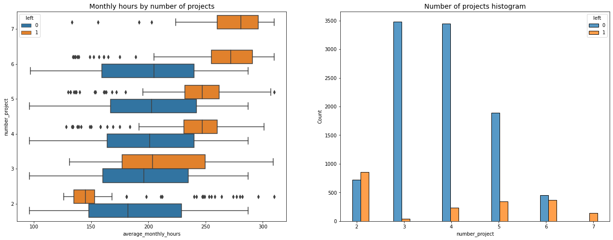
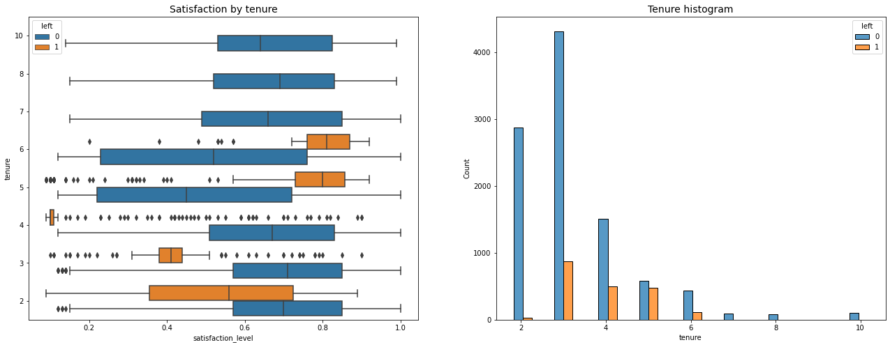
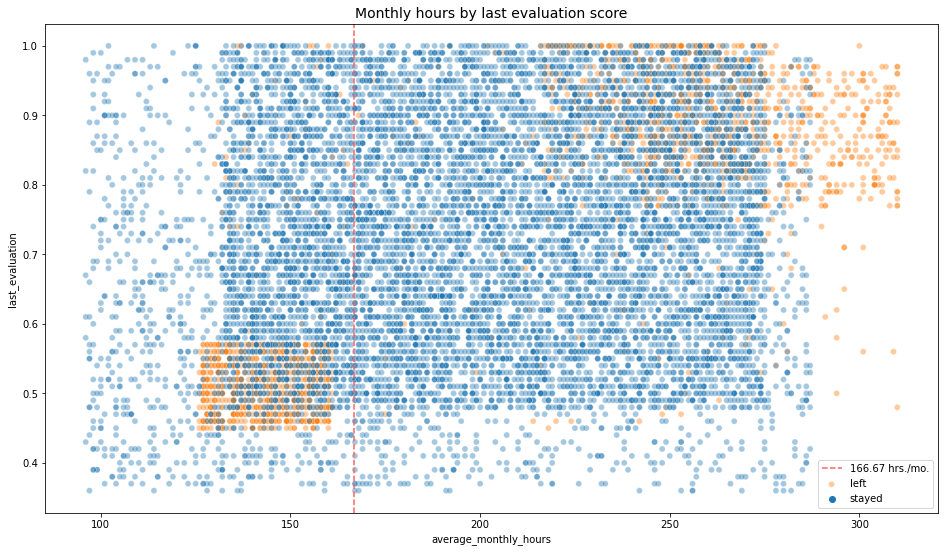

# Salifort Motors Employee Retention Prediction

### Google Advanced Data Analytics Capstone | HR Analytics | Machine Learning | Data-Driven Retention Strategy

This project analyzes employee data from Salifort Motors to identify the factors most associated with employee turnover and build a machine learning model that predicts whether an employee is likely to leave. The final output is designed for HR stakeholders who need clear, actionable retention recommendations rather than only model metrics.

The project follows Google's PACE workflow: **Plan, Analyze, Construct, Execute**.

---

## Portfolio Links

| Artifact | Description |
|---|---|
| [Final Notebook](Salifort_Motors_project_lab.ipynb) | Complete EDA, data cleaning, modeling, evaluation, and recommendations |
| [Executive Summary](<stakeholder_executive_summary.pptx>) | Stakeholder-facing presentation of findings and recommendations |
| [PACE Strategy Document](<project_strategy_and_reflection.docxs.docx>) | Project planning, analysis strategy, and reflection document |
| [Visual Assets](assets/images) | Exported charts used in this README |

---

## Business Problem

Salifort Motors wants to improve employee satisfaction and reduce employee turnover. Hiring and onboarding replacements is expensive, so the HR department needs to understand what makes employees leave and how to identify at-risk employees early enough to intervene.

The central question:

> What factors are most likely to make an employee leave the company?

---

## Dataset

The dataset contains **14,999 employee records** and **10 variables** related to satisfaction, performance, workload, tenure, salary, department, promotion history, work accidents, and whether the employee left the company.

Source: [HR Analytics and Job Prediction dataset on Kaggle](https://www.kaggle.com/datasets/mfaisalqureshi/hr-analytics-and-job-prediction?select=HR_comma_sep.csv)

Key fields used in the analysis:

| Field | Meaning |
|---|---|
| `satisfaction_level` | Employee-reported satisfaction score from 0 to 1 |
| `last_evaluation` | Last performance evaluation score |
| `number_project` | Number of active projects |
| `average_monthly_hours` | Average monthly working hours |
| `tenure` | Years spent at the company |
| `promotion_last_5years` | Whether the employee was promoted in the last five years |
| `salary` | Low, medium, or high salary group |
| `left` | Target variable: whether the employee left |

---

## Methodology

| PACE Stage | What I Did |
|---|---|
| Plan | Defined the HR retention problem, stakeholders, target variable, and ethical risks |
| Analyze | Cleaned the data, checked missing values, duplicates, outliers, and explored turnover patterns |
| Construct | Built Logistic Regression, Decision Tree, and Random Forest classifiers |
| Execute | Selected the stronger model, interpreted feature importance, and translated results into HR recommendations |

---

## Analysis Story

The analysis showed that turnover is not evenly random across the workforce. Employees who left were often connected to workload intensity, project count, tenure patterns, and evaluation outcomes.

One of the clearest findings was that employees with very high project loads and very long working hours were much more likely to leave. Every employee assigned to seven projects left the company. Employees working roughly 240 to 315 hours per month also formed a visible high-risk group, suggesting potential burnout.



Satisfaction was another major signal. Employees who left generally had lower satisfaction scores, especially among shorter-tenure employees. Four-year employees who left had unusually low satisfaction, which may point to a specific career-stage or promotion-related issue.



The relationship between working hours and evaluation scores also raised an important management concern: high evaluations appeared connected to high workloads. This suggests that the company may be unintentionally rewarding sustained overwork.



---

## Modeling Strategy

This is a binary classification task because the model predicts whether an employee **left** or **stayed**.

I tested three model families:

| Model | Purpose |
|---|---|
| Logistic Regression | Baseline interpretable model |
| Decision Tree | Interpretable nonlinear model |
| Random Forest | Stronger ensemble model for final prediction |

After the first modeling round, I considered potential data leakage. `satisfaction_level` may not always be available before an employee leaves, and detailed monthly hours may partially reflect employees who already decided to leave or were already being managed out.

To reduce that risk, I created an `overworked` feature and removed `satisfaction_level` and `average_monthly_hours` from the final modeling round. The final model still performed strongly, which made the results more useful for a realistic HR use case.

---

## Model Performance

The final selected model was a **Random Forest classifier** after feature engineering.

| Model | Precision | Recall | F1 | Accuracy | AUC |
|---|---:|---:|---:|---:|---:|
| Logistic Regression baseline | 0.79 | 0.82 | 0.80 | 0.82 | N/A |
| Random Forest, initial feature set | 0.964 | 0.920 | 0.941 | 0.981 | 0.956 |
| Random Forest, leakage-aware feature set | 0.870 | 0.904 | 0.887 | 0.962 | 0.938 |

The leakage-aware Random Forest is the preferred portfolio model because it balances strong predictive performance with more realistic deployment assumptions.


The most important predictors were:

1. `last_evaluation`
2. `number_project`
3. `tenure`
4. `overworked`


---

## Business Recommendations

Based on the EDA and final model, Salifort Motors should focus retention efforts on workload design, promotion fairness, and evaluation practices.

Recommended actions:

- Cap or closely review employees assigned to unusually high numbers of projects.
- Investigate why four-year-tenure employees show low satisfaction and elevated turnover risk.
- Review whether high evaluation scores are overly tied to extreme working hours.
- Clarify overtime expectations, compensation policies, and time-off norms.
- Use the model as an early support tool, not as a punitive employee monitoring system.
- Open team-level discussions about workload pressure and burnout risk.

---

## Ethical Considerations

Employee attrition models should be used carefully. A prediction that someone may leave should trigger support, workload review, or career-development conversations, not disciplinary action.

Important safeguards:

- Do not use model predictions as the sole basis for HR decisions.
- Monitor whether predictions differ unfairly across departments, salary groups, or tenure groups.
- Revalidate the model with current company data before deployment.
- Be transparent with stakeholders about possible data leakage and synthetic-data patterns observed in the dataset.

---

## Repository Structure

```text
Salifort-Motors-Employee-Retention-Prediction/
|
|-- README.md
|-- requirements.txt
|-- Salifort_Motors_project_lab.ipynb
|-- stakeholder_executive_summary.pptx
|-- project_strategy_and_reflection.docxs.docx
|-- assets/
|   `-- images/
|       |-- project_load_vs_hours.png
|       |-- satisfaction_by_tenure.png
|       |-- satisfaction_vs_monthly_hours.png
|       |-- hours_vs_evaluation.png
|       |-- correlation_heatmap.png
|       |-- random_forest_confusion_matrix.png
|       `-- random_forest_feature_importance.png
```

---

## How to Run

1. Clone the repository:

```bash
git clone https://github.com/height190/Salifort-Motors-Employee-Retention-Prediction.git
cd Salifort-Motors-Employee-Retention-Prediction
```

2. Create and activate a virtual environment:

```powershell
python -m venv .venv
.\.venv\Scripts\Activate.ps1
```

3. Install dependencies:

```bash
pip install -r requirements.txt
```

4. Add the dataset file to the project root:

```text
HR_capstone_dataset.csv
```

5. Launch Jupyter and open the final notebook:

```bash
jupyter lab Salifort_Motors_project_lab.ipynb
```

---

## Tools Used

- Python
- pandas, NumPy
- Matplotlib, Seaborn
- scikit-learn
- XGBoost imports for experimentation
- Jupyter Notebook
- PowerPoint and Word for stakeholder deliverables

---

## Next Steps

Future improvements could include removing `last_evaluation` to test an even stricter leakage-aware model, validating the model on newer HR data, and clustering employees into retention-risk profiles for more targeted interventions.
