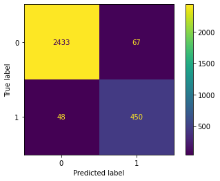
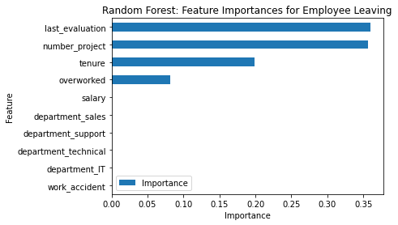

# Salifort Motors Employee Retention Prediction


> An end-to-end machine learning and analytics capstone project completed as part of the **Google Advanced Data Analytics Professional Certificate**.

This project analyzes employee attrition patterns at Salifort Motors and builds a classification model to help HR teams identify employees at higher risk of leaving. The emphasis is not only on model performance, but also on business interpretation, ethical use, and practical retention recommendations.



## Table of Contents

- [Project Overview](#project-overview)
- [Business Problem](#business-problem)
- [Project Objectives](#project-objectives)
- [Dataset Description](#dataset-description)
- [Tech Stack](#tech-stack)
- [Methodology](#methodology)
- [EDA Summary](#eda-summary)
- [Machine Learning Workflow](#machine-learning-workflow)
- [Model Performance](#model-performance)
- [Key Findings](#key-findings)
- [Business Recommendations](#business-recommendations)
- [Repository Structure](#repository-structure)
- [Installation](#installation)
- [How to Run](#how-to-run)
- [Results](#results)
- [Future Improvements](#future-improvements)
- [Author](#author)
- [License](#license)

## Project Overview

Salifort Motors wants to reduce employee turnover by understanding which workplace factors are most associated with attrition. This project follows a full analytics workflow: data cleaning, exploratory analysis, feature engineering, model training, evaluation, and stakeholder recommendations.

The final model is positioned as an HR decision-support tool. It should help prioritize workload reviews, retention conversations, and policy audits, not automate employment decisions.

## Business Problem

Employee turnover is expensive because it increases hiring, onboarding, training, and productivity costs. Salifort Motors needs to answer:

> Which factors are most likely to make an employee leave, and how can HR intervene earlier?

The project focuses on translating employee data into actionable retention strategies around workload, satisfaction, promotion history, evaluation practices, and operational planning.

## Project Objectives

| Objective | Outcome |
|---|---|
| Clean and prepare HR data | Standardized fields, removed duplicates, documented data quality |
| Explore attrition drivers | Identified patterns across workload, tenure, satisfaction, and evaluations |
| Build predictive models | Compared Logistic Regression, Decision Tree, and Random Forest models |
| Evaluate model quality | Used precision, recall, F1, accuracy, AUC, confusion matrix, and ROC curve |
| Translate findings | Developed practical recommendations for HR and operations stakeholders |

## Dataset Description

The dataset contains employee-level HR records from the Salifort Motors capstone scenario.

| Field | Description |
|---|---|
| `satisfaction_level` | Employee satisfaction score from 0 to 1 |
| `last_evaluation` | Most recent performance evaluation score |
| `number_project` | Number of active projects assigned to the employee |
| `average_monthly_hours` | Average monthly working hours |
| `tenure` | Years at the company |
| `work_accident` | Whether the employee had a workplace accident |
| `promotion_last_5years` | Whether the employee was promoted in the last five years |
| `department` | Employee department |
| `salary` | Salary band: low, medium, high |
| `left` | Target variable: 1 if employee left, 0 if stayed |

The raw CSV is not committed. To reproduce the project, place `HR_capstone_dataset.csv` in `data/raw/`.

## Tech Stack

- Python
- pandas and NumPy
- Matplotlib and Seaborn
- scikit-learn
- Jupyter Notebook
- Markdown reporting

## Methodology

This project uses the Google PACE framework:

| Stage | Work Completed |
|---|---|
| Plan | Defined stakeholder problem, target variable, success metrics, and ethical constraints |
| Analyze | Cleaned data, checked duplicates/missing values, explored attrition patterns |
| Construct | Engineered features, split train/test data, trained candidate classifiers |
| Execute | Evaluated model results and converted findings into HR recommendations |

## EDA Summary

Exploratory analysis focused on how attrition changes by workload, tenure, satisfaction, evaluation score, promotion history, and salary band.

Key visual references:

| Visualization | Path |
|---|---|
| Class distribution | `images/eda/class_distribution.png` |
| Correlation heatmap | `images/eda/correlation_heatmap.png` |
| Project load vs. monthly hours | `images/eda/project_load_vs_hours.png` |
| Satisfaction by tenure | `images/eda/satisfaction_by_tenure.png` |
| Satisfaction vs. monthly hours | `images/eda/satisfaction_vs_monthly_hours.png` |


## Machine Learning Workflow

The modeling workflow treats attrition as a binary classification problem.

1. Standardize column names and remove duplicate records.
2. Engineer interpretable HR features such as `overworked`.
3. Split the dataset into stratified training and test sets.
4. Train Logistic Regression, Decision Tree, and Random Forest models.
5. Compare models using precision, recall, F1, accuracy, and AUC.
6. Review confusion matrix, ROC curve, and feature importance.
7. Translate model signals into retention recommendations.

The selected portfolio model is a **leakage-aware Random Forest**. It removes `satisfaction_level` and avoids relying directly on raw `average_monthly_hours` because those signals may be less appropriate for early intervention depending on when and how HR collects them.

## Model Performance

| Model | Precision | Recall | F1 | Accuracy | AUC |
|---|---:|---:|---:|---:|---:|
| Logistic Regression baseline | 0.790 | 0.820 | 0.800 | 0.820 | N/A |
| Random Forest, initial feature set | 0.964 | 0.920 | 0.941 | 0.981 | 0.956 |
| Random Forest, leakage-aware feature set | 0.870 | 0.904 | 0.887 | 0.962 | 0.938 |

Recall is prioritized because a false negative means HR may miss an employee who is likely to leave. Precision still matters because interventions should be focused, respectful, and operationally realistic.



## Key Findings

- Attrition is concentrated in identifiable employee profiles rather than evenly distributed.
- High project counts and high monthly hours are strong warning signs for retention risk.
- Four-year tenure employees show notable satisfaction and attrition patterns, suggesting a career-stage issue.
- Evaluation scores appear connected with workload intensity, which may indicate performance systems rewarding overwork.
- Promotion history and salary bands are useful business context for HR policy review.

## Business Recommendations

| Area | Recommendation | Business Rationale |
|---|---|---|
| Workload | Review employees with unusually high project counts and sustained high monthly hours | Reduces burnout risk and improves operational capacity planning |
| Satisfaction | Use satisfaction trends as a retention signal, especially for mid-tenure employees | Helps identify employees who may be disengaging before resignation |
| Promotion | Audit promotion patterns for employees around three to five years of tenure | Addresses career stagnation and perceived lack of advancement |
| Evaluation | Review whether high evaluations are tied to excessive workloads | Prevents a culture where high performance requires unsustainable hours |
| HR Strategy | Use model outputs to prioritize support conversations, not employment decisions | Keeps the model ethical and useful as a decision-support tool |

## Repository Structure

```text
.
|-- README.md
|-- requirements.txt
|-- .gitignore
|-- LICENSE
|
|-- data/
|   |-- raw/
|   `-- processed/
|
|-- notebooks/
|   |-- 01_data_cleaning.ipynb
|   |-- 02_eda.ipynb
|   |-- 03_modeling.ipynb
|   `-- 04_model_evaluation.ipynb
|
|-- src/
|   |-- preprocessing.py
|   |-- feature_engineering.py
|   |-- train.py
|   |-- evaluate.py
|   `-- utils.py
|
|-- images/
|   |-- eda/
|   |-- modeling/
|   `-- results/
|
|-- reports/
|   |-- executive_summary.md
|   |-- business_recommendations.md
|   `-- final_presentation.md
|
`-- docs/
    |-- methodology.md
    `-- project_scope.md
```

## Installation

Clone the repository:

```bash
git clone https://github.com/height190/Salifort-Motors-Employee-Retention-Prediction.git
cd Salifort-Motors-Employee-Retention-Prediction
```

Create and activate a virtual environment.

Windows PowerShell:

```powershell
python -m venv .venv
.\.venv\Scripts\Activate.ps1
```

macOS/Linux:

```bash
python3 -m venv .venv
source .venv/bin/activate
```

Install dependencies:

```bash
pip install -r requirements.txt
```

## How to Run

Add the raw dataset:

```text
data/raw/HR_capstone_dataset.csv
```

Run notebooks in order:

```bash
jupyter lab
```

Recommended execution order:

1. `notebooks/01_data_cleaning.ipynb`
2. `notebooks/02_eda.ipynb`
3. `notebooks/03_modeling.ipynb`
4. `notebooks/04_model_evaluation.ipynb`

Generated outputs are written to:

```text
data/processed/
images/eda/
images/modeling/
images/results/
```

## Results

The leakage-aware Random Forest model achieved strong classification performance while preserving a more realistic HR use case. The most important model signals were related to evaluation score, project load, tenure, and overwork.

The business value is a repeatable workflow that helps HR identify where retention risk may be emerging and which operational policies deserve review.

## Future Improvements

- Validate the model on current company data rather than historical capstone data.
- Test stricter leakage controls by removing `last_evaluation`.
- Add department-level fairness and error analysis.
- Tune probability thresholds based on HR outreach capacity.
- Build a dashboard to monitor workload, tenure, and attrition-risk trends.

## Author

**Minhyuk Lee**  
Google Advanced Data Analytics Professional Certificate Capstone  
Portfolio focus: data analytics, machine learning, HR analytics, business recommendations

## License

This project is licensed under the MIT License. See [LICENSE](LICENSE) for details.
